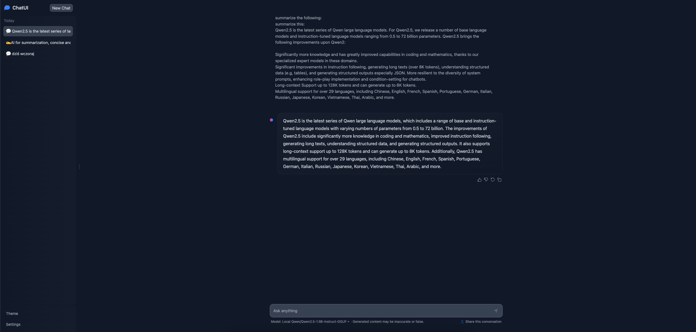

# RAG <-> LORA Comparision

Repository containing scripts to compare vanila model to it's `RAG` and fine-tuned `LoRA` vesrison.

## Model

As this experiment was performed locally on MacBook Pro 16' (36 Gb RAM) I had to carefully select the model so the `LoRA` fine-tuning process would fit into the memory as Metal (MPS) does not yet support quantization to INT8 or INT4.

Given the mentioned requirements I decided to choose `Qwen/Qwen2.5-1.5B-Instruct`.

Qwen2.5 is the latest series of Qwen large language models. The models range in size from 0.5 to 72 billion parameters and offer improvements in various areas such as coding and mathematics. Qwen2.5 also improves instruction following, generating long texts, understanding structured data, and generating structured outputs. It also supports long context up to 128K tokens, generating up to 8K tokens, and multilingual support for over 29 languages. Additionally, it has improved resilience to system prompts and enhances role-play implementation and condition-setting for chatbots.

## Training

TBD.

## Inference

Best model is available via chat ui using `llama-server` and `mongoDB`. This allow for local interaction with the model without the need to call any external server. All of the conversations are saved into mongoDB database so user can see the history of his interactions with the model.

